# Pages Structure of the App

## Introduction to this document

Emoji's used for clarification:
- ⭐ subscribed only
    - the star will tell you which parts of the app are subscribe only
- 🆓 unsubscribed only
    - the free emoji will show you the parts which are only shown when there is no subscribed user signed in

## Components
### Header

- Logo and catchphrase
- Wallet Connect

### Wallet Connect

Pretty standard wallet connect button.

### WhatToWatchAIDialog

#### Functionality
##### Subscribed ⭐
Initial question from the what to watch agent:
 - WHAT TO WATCH THIS EVENING WITH FRENS AND FAM if I WANT TO TEACH THEM ABOUT BLOCKCHAIN, WEB3 ETC
 - After the first answer you get a link to [WhatToWatchAgent](#whattowatchagent)

##### Unsubscribed 🆓
Initial question from the what to watch agent:
 - WHAT TO WATCH THIS EVENING WITH FRENS AND FAM if I WANT TO TEACH THEM ABOUT BLOCKCHAIN, WEB3 ETC
 - When first answer is received, you can only click the subscribe button

## Pages

### Index

|       property   |  value |
| ---------------- | ------------ |
| page             | src/app/page.tsx |
| description      | Entry page |
| subscribed_only  | no         |

#### Content

- Buttons to:
    - [Try the app](#dashboard)
    - [Subscribe to get the full experience](#subscribe)
    - [Support a filmmaker](#supportfilmmaker)
- Information:
    - Text about the project

### Dashboard

|       property   |  value |
| ---------------- | ------------ |
| page             | src/app/dashboard/page.tsx |
| description      |  |
| subscribed_only  | no         |

#### Content

- [WhatToWatchAIDialog](#whattowatchaidialog)
- Buttons to:
    - [Film tokens comparison](#filmtokens)
    - ⭐[guide for a filmmaker in the world of blockchain](#filmmakersguide)
    - 🆓not available without subscription / guide for a filmmaker in the world of blockchain
        - this is greyed out button
    - [Support a filmmaker](#supportfilmmaker)

### FilmTokens

|       property   |  value |
| ---------------- | ------------ |
| page             | src/app/tokens/page.tsx |
| description      | Film Tokens |
| subscribed_only  | no         |

### FilmToken Details

|       property   |  value |
| ---------------- | ------------ |
| page             | src/app/tokens/[[...tokens]].tsx |
| description      | Film Token Details |
| subscribed_only  | no         |

### Subscribe

|       property   |  value |
| ---------------- | ------------ |
| page             | src/app/subscribe/page.tsx |
| description      | Subscribe to the app |
| subscribed_only  | no         |

### SupportFilmMaker

|       property   |  value |
| ---------------- | ------------ |
| page             | src/app/support-film-maker/page.tsx |
| description      | Support a film maker by subscribing to the app |
| subscribed_only  | no         |

#### Content

- Buttons to:
    - 🆓 [Subscription Button](#subscribe)

### WhatToWatchAgent

|       property   |  value |
| ---------------- | ------------ |
| page             | src/app/what-to-watch/page.tsx |
| description      | What to watch agent |
| subscribed_only  | yes         |

#### Content

- Window to chat with agent about films

### FilmMakersGuide
|       property   |  value |
| ---------------- | ------------ |
| page             | src/app/film-makers-guide/page.tsx |
| description      | Film makers guide agent |
| subscribed_only  | yes         |
#### Content
- Window to chat with agent to talk about film making with

## Diagram

